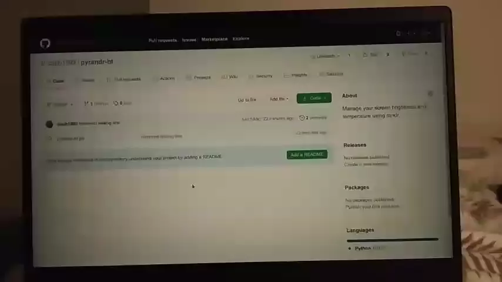

# PyRandr-BT

Protect your eyes. Manage your screen brightness and temperature using randr. **(for linux systems)**

This script lets you modify the software brightness and [temperature](https://en.wikipedia.org/wiki/Color_temperature) manually from the command line. You can assign it to a global hotkey for ease of access.

For the hardware brightness, also called backlight, check out `brightnessctl`.

## Why?

 - We spend many hours on the screen.
 - Screens are too bright, even on 1% backlight.
 - `xrandr` supports brightness but not temperature (the gamma function is terrible)
 - `redshift` supports setting both, but not reading, increasing or decreasing. Forhtermore, it has tons of dependencies and uses your location by default. It's too complex for such a simple task.
 - No other open source software is available.

## How to use?

Install `python3-xlib`, copy the script `pyrandr-bt.py` and run it with `python3 pyrandr-bt.py`. You will see the available commands.

The `-c` (combined) function makes it simple to make the screen

 - 'darker and warmer' (`python3 pyrandr-bt.py -c -5`), or
 - 'lighter and cooler (white)' (`python3 pyrandr-bt.py -c +5`).

Assign them to some global hotkeys for the best experience.

## Video

I wished I could record the screen from the screen recorder, but screen recorders can't see the screen filters that are applied.

